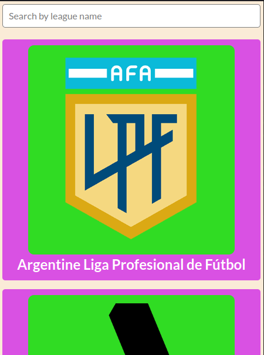

  

# Math magician
Math magicians is a website for all fans of mathematics. It is a Single Page App (SPA) that allows users to:
- Make simple calculations.
- Read a random math-related quote.

### Built With

- React.
- CSS.
- HTML
- JavaScript.

### Quick View 
#### Desktop

#### Mobile

## Getting Started

- To run a local copy of this project follow these simple steps.

### Prerequisites
- A modern web browser, preferably Chrome or Firefox

### Cloning the repository
- Create a directory.
- Open a terminal in this directory and run this command: `git clone git@github.com:wayungi/math-magicians.git`.
- cd math-maicians
- run npm install
- run npm start
- The website will in your default browser

## Video presenation
[Video Presentation Link](https://loom.com/share/8d21a16739084f18895706261b67d695)

## Live Demo

[Live Demo Link](https://exquisite-lollipop-092746.netlify.app/)

## Authors

👤 **Francis Wayungi**

- GitHub: [@githubhandle](https://github.com/wayungi)
- Twitter: [@twitterhandle](https://twitter.com/FrancisWayungi)
- LinkedIn: [LinkedIn](https://linkedin.com/in/francis-wayungi-3aa626231)

## 🤝 Contributing

Contributions, issues, and feature requests are welcome!

Feel free to check the [issues page](../../issues/).

## Show your support

Give a ⭐️ if you like this project!

## Acknowledgments
- [Football standings API](https://github.com/azharimm/football-standings-api)
- [Orignal design Idea is by Nelson Sakwa on Behance](https://www.behance.net/sakwadesignstudio)

## 📝 License

This project is [MIT](./MIT.md) licensed.
